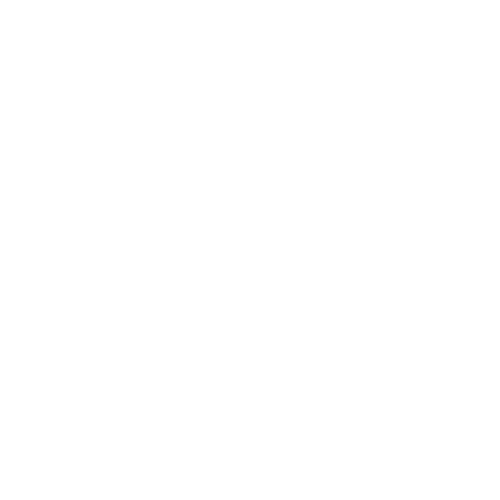

<p align="center">
  <a href="https://arulvalananto.gatsbyjs.io/">
    
  </a>
</p>
<h1 align="center">
  Arul Valan Anto - Portfolio
</h1>

## 🚀 Quick start

1. **Install package dependencies**

    ```shell
    npm install
    ```

2. **Run locally**

    ```shell
    cd portfolio/
    npm run develop
    ```

3. **Open the code and start customizing!**

    Your site is now running at <http://localhost:8000>!
